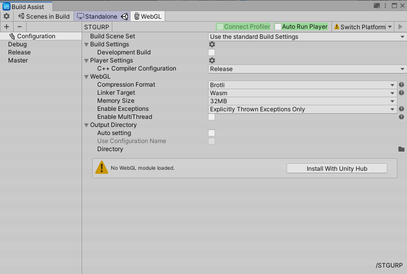

# BuildAssist


[Japanese](https://translate.google.com/translate?sl=en&tl=ja&u=https://github.com/hananoki/BuildAssist) (by Google Translate)

## Overview
- An auxiliary tool for differential build, batch build, etc.



## Installation
- Add following lines to the `dependencies` section of the `Packages/manifest.json`.
```js
"dependencies": {
  "com.hananoki.build-assist": "https://github.com/hananoki/BuildAssist.git",
  "com.hananoki.shared-module": "https://github.com/hananoki/SharedModule.git",
  "com.hananoki.unity-reflection": "https://github.com/hananoki/UnityReflection.git",
  ...
}
```

## Licence

[MIT](https://github.com/hananoki/BuildAssist/blob/master/LICENSE.md)